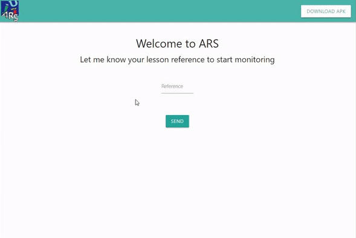

# ars-server #

Server of the Audience Response System proyect.

## Description
ARS is a 'quiz' for lectures where a lecturer makes questions and his audience responds in a gamified way. In our approach there are three clients: lecturer, audience and monitor. Lecturer and audience are oriented to be mobile device clients, and a Java API which interacts with the server is presented [here](https://github.com/adriBall/ars-api-java). On the other side, monitor is oriented to be a web client, so a simple implementation is provided within this server project.

  

This is an academical work for a software engineering software subject. It is not ready for production and its main objectives are the use of websockets and a good software design through the use of design patterns. Class diagrams of how the server code has been designed are [here](docs/ClassDiagrams.md).
